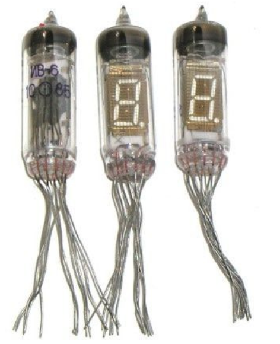

# tube_clock

Firmware for the [IV-6](https://www.istok2.com/data/1705/) [vacuum fluorescent display](https://en.wikipedia.org/wiki/Vacuum_fluorescent_display) clock.

MIT License

Copyright (c) 2020 Stan
